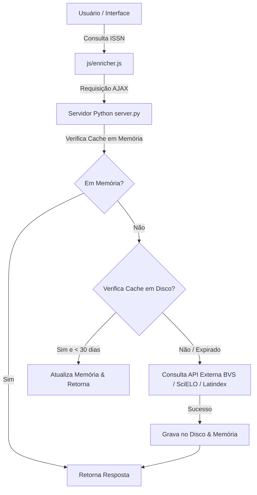

# Relatório de Modernização e Arquitetura - Sprint 1 (Junho/2026)

Este documento apresenta o relatório técnico das entregas realizadas na **Sprint 1** para o sistema **Classificador Qualis CAPES (Enfermagem e Outras Áreas)**. As melhorias focaram na reformulação completa da experiência do usuário (UI/UX) e na estabilidade e eficiência de enriquecimento de dados externos por meio de caching híbrido persistente.

---

## 📋 Resumo Executivo

O objetivo desta sprint foi transformar uma ferramenta de diagnóstico interno em uma plataforma analítica moderna, intuitiva e de alta performance para a classificação de periódicos científicos pelo estrato do Qualis CAPES.

As principais conquistas da sprint incluem:
1. **Redesenho Completo da Interface**: Transição para uma interface premium responsiva de duas colunas, com visual *Glassmorphism*, modo escuro e claro integrados, cards de KPIs de resumo e gráficos analíticos interativos.
2. **Sistema de Cache Híbrido Persistente**: Otimização das requisições para os indexadores **SciELO**, **LILACS** e **Latindex** usando proxy local e persistência em disco com tempo de vida (TTL) de 30 dias.
3. **Indicadores de Transparência**: Inclusão de tooltips detalhados com as justificativas de classificação da CAPES e as datas reais das últimas consultas às fontes oficiais brasileiras e ibero-americanas.

---

## 🛠️ Detalhamento das Entregas

### 1. Interface do Usuário (UI/UX) e Analytics
Substituiu-se a exibição estática da base de dados local por um painel interativo focado no fluxo de análise do usuário.

* **Barra Lateral de Ferramentas**: Consolidou as formas de entrada de dados (consulta individual, lote de ISSNs e upload de arquivos CSV) de forma compacta na esquerda.
* **Dashboard Analítico**:
  * **Cards de KPIs**: Exibição em tempo real do total de periódicos analisados, maior JCR, maior CiteScore e o percentual de artigos indexados em bases qualificadas de prestígio.
  * **Gráficos Dinâmicos (Chart.js)**: Gráfico de Rosca mostrando a distribuição por estratos Qualis (A1 ao NC) e Gráfico de Barras Horizontais consolidando a quantidade de periódicos indexados em cada base (SciELO, Scopus, Medline, JCR, Latindex, RIC/CUIDEN).
  * **Empty State**: Uma tela amigável orienta o usuário no primeiro acesso, com animações suaves de entrada e flutuação.
* **Tooltips Premium**: Tooltips baseados em CSS puro fornecem feedback instantâneo sobre as regras aplicadas e a data de consulta da indexação ao passar o mouse.

### 2. Arquitetura de Cache Híbrido Persistente (LILACS, SciELO e Latindex)
Para mitigar problemas de latência, excesso de chamadas às APIs externas e contornar bloqueios de firewalls das fontes originais, implementou-se uma arquitetura de cache em dois níveis:

* **Backend Proxy**: `server.py` implementa rotas segregadas `/api/scielo/{issn}`, `/api/lilacs/{issn}` e `/api/latindex/{issn}` para centralizar chamadas de rede do servidor, eliminando problemas de CORS.
* **Respeito às APIs e Fontes Oficiais**: As APIs de periódicos da LILACS, SciELO ArticleMeta e o portal de busca avançada do Latindex são consultados sob demanda apenas se o dado local tiver expirado (idade > 30 dias), reduzindo drasticamente a carga sobre essas plataformas públicas.

---

## 📂 Estrutura de Arquivos Atualizada

Abaixo está a disposição dos principais módulos do projeto sob a pasta raiz:

* 📁 `docs/` — Relatórios de sprint e documentação de arquitetura.
* 📁 `data/` — Bases de dados de referência locais e arquivos de persistência física:
  * 📄 `scielo_cache.json` — Cache físico das respostas da API SciELO.
  * 📄 `lilacs_cache.json` — Cache físico das respostas da API LILACS.
  * 📄 `latindex_cache.json` — Cache físico das respostas da busca no Latindex.
  * 📄 `journals.json` — Base de periódicos compilada localmente.
* 📁 `js/` — Lógica do sistema no cliente web:
  * 📄 [app.js](file:///c:/Dev/Qualis-capes/js/app.js) — Controlador de interface, renderização da tabela, gráficos e KPIs.
  * 📄 [enricher.js](file:///c:/Dev/Qualis-capes/js/enricher.js) — Módulo de consulta inteligente assíncrona às APIs e composição dos dados de revistas.
  * 📄 [engine.js](file:///c:/Dev/Qualis-capes/js/engine.js) — Motor de inferência que implementa a árvore de decisão da classificação da CAPES.
  * 📄 [utils.js](file:///c:/Dev/Qualis-capes/js/utils.js) — Parser de CSV, gerador de arquivos para download e detecção de delimitador.
  * 📄 [tests.js](file:///c:/Dev/Qualis-capes/js/tests.js) — Suíte de testes unitários com cobertura de 38 cenários de classificação.
* 📁 `css/` — Estilização do aplicativo:
  * 📄 [styles.css](file:///c:/Dev/Qualis-capes/css/styles.css) — Variáveis CSS de temas, definições de layout Grid/Flex e o sistema de tooltips customizados.
* 📄 [server.py](file:///c:/Dev/Qualis-capes/server.py) — Servidor HTTP nativo e gerenciador de endpoints de proxy e cache.

---

## 🧪 Diagnóstico e Testes

O motor de regras do classificador é verificado a cada carregamento no navegador por meio de testes automatizados e isolados que garantem conformidade total com os critérios estabelecidos da CAPES para Enfermagem e demais áreas:

* **Critério de Enfermagem**: Regras de estrato baseadas em JCR/CiteScore, indexação em bases como MEDLINE (A3), SciELO/RevEnf (A4), LILACS/BDENF (A5), CUIDEN (A6/A7), CINAHL (A7), Latindex (A8) e regra de melhor caso.
* **Critério de Outras Áreas**: Classificação linear com base em faixas de JCR/CiteScore do estrato A1 ao A6, bases SciELO (A6), LILACS (A7), Latindex (A8) e NC se ausente.
* **Resultado**: **100% de aprovação** nos 38 cenários de teste validados no console do desenvolvedor.
