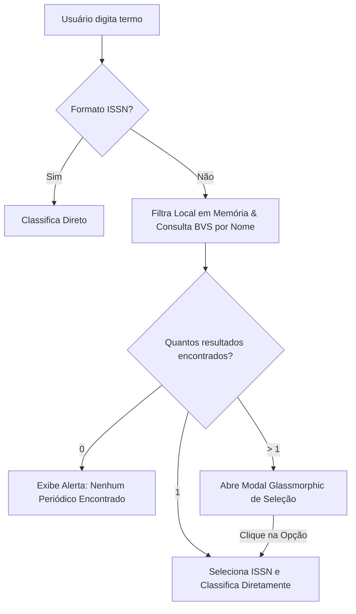

# Relatório de Modernização, Interatividade e Expansão de Bases - Sprint 2 (Junho/2026)

Este documento apresenta o relatório técnico das entregas realizadas na **Sprint 2** (sprint atual) para o sistema **Classificador Qualis CAPES (Enfermagem e Outras Áreas)**. As melhorias focaram na expansão das capacidades de busca híbrida por título de periódicos, otimizações visuais no cabeçalho, personalização cromática de gráficos, carregamento interativo premium e enriquecimento de dados com a base **BDENF**.

---

## 📋 Resumo Executivo

O objetivo desta sprint foi refinar a usabilidade e a precisão do classificador, oferecendo aos pesquisadores ferramentas mais intuitivas para identificação e classificação de revistas científicas de forma rápida e elegante.

As principais conquistas da sprint incluem:
1. **Busca Híbrida por Nome e ISSN**: Flexibilização da consulta individual, permitindo a pesquisa tanto por ISSN quanto pelo título parcial da revista, com resolução de ambiguidades através de um modal de seleção.
2. **Integração em Tempo Real da Base BDENF**: Proxy unificado na API da rede BVS (BIREME) para detectar se o periódico está catalogado no Banco de Dados de Enfermagem, permitindo a classificação correta em estrato **A5** da CAPES.
3. **Feedback Visual Premium (Loading Overlay)**: Substituição do cursor de espera nativo do mouse por um overlay glassmorphic centralizado em tela cheia, com spinner em gradiente cônico e textos/ícones dinâmicos.
4. **Harmonização Cromática e Respiro Visual**: Reorganização do cabeçalho eliminando redundâncias de texto e aplicação de cores clássicas corporativas nas barras do gráfico de indexadores para facilitar a leitura visual imediata (SciELO = vermelho, Medline = azul, JCR = roxo, Latindex = verde, Scopus = laranja, BDENF = teal).

---

## 🛠️ Detalhamento das Entregas

### 1. Busca Híbrida por Título de Periódico e Modal de Seleção
A busca individual foi expandida para aceitar strings de texto livre.
* **Consolidação Local e Remota**: O sistema varre o banco local na memória do cliente em busca de substrings no título (ignorando acentos e caixas de letras) e, em paralelo, realiza a consulta remota à API do Solr da BVS.
* **Unificação por ISSN Real**: Para evitar duplicidades entre dados em disco e respostas de rede, o backend ([server.py](file:///c:/Dev/Qualis-capes/server.py)) foi modificado para extrair o campo de ISSN real das respostas do Solr. Isso permite ao frontend agrupar e unificar os resultados duplicados sob a mesma chave.
* **Modal Glassmorphic de Seleção**: Se a busca retornar mais de 1 resultado correspondente, um modal centralizado com desfoque de fundo e bordas translúcidas é exibido com a lista de periódicos encontrados (exibindo título, área e ISSN). O clique em um item seleciona-o para classificação imediata e fecha o modal. Se a busca retornar exatamente 1 item, a classificação ocorre direto e sem abrir o modal.

---

### 2. Integração em Tempo Real do BDENF (BVS/BIREME)
A base **BDENF (Banco de Dados de Enfermagem)** foi integrada à rotina de classificação dinâmica em tempo real.
* **Análise de Metadados Solr**: O proxy `/api/lilacs/{issn}` agora varre a propriedade `indexed_database` do registro bibliográfico retornado pela BVS. Se a coleção contiver a string `"BDENF"`, a propriedade `"bdenf"` é transmitida como `true`.
* **Motor de Inferência**: O arquivo [js/enricher.js](file:///c:/Dev/Qualis-capes/js/enricher.js) mapeia o retorno e insere `'BDENF'` nos indexadores ativos. A regra em [js/engine.js](file:///c:/Dev/Qualis-capes/js/engine.js) classifica automaticamente o periódico da área de Enfermagem como estrato **A5** com a justificativa *"Indexado no BDENF"*, caso métricas superiores de JCR/CiteScore não se apliquem.
* **Migração e Persistência**: Implementou-se um versionador dinâmico de cache que detecta se os arquivos locais da LILACS em disco (`data/lilacs_cache.json`) contêm a propriedade `"bdenf"`. Caches antigos sem essa propriedade são invalidados e atualizados na primeira busca.

---

### 3. Overlay de Carregamento Premium (Glassmorphic Loading)
Substituímos o cursor do mouse padrão por um overlay interativo de alto padrão visual:
* **Prevenção de Ações Concorrentes**: A tela é bloqueada com um desfoque suave (`backdrop-filter: blur(12px)`) e fundo translúcido escuro (ou claro, dependendo do tema), evitando cliques múltiplos acidentais pelo usuário.
* **Spinner Cônico e Ícones Contextuais**: Um spinner circular animado com gradiente cônico (nas cores roxo e violeta do projeto) gira continuamente ao redor de um ícone vetorial da biblioteca Lucide. O ícone pulsa no centro do spinner e muda dinamicamente de acordo com a operação executada:
  * Lupa (`search`) para consultas individuais.
  * Camadas (`layers`) para envios em lote de ISSNs.
  * Planilha (`file-spreadsheet`) para importações e leitura de arquivos CSV.
* **Mensagens de Status Dinâmicas**: Textos informativos detalham qual etapa do processamento está ocorrendo (ex: *"Analisando Consulta"*, *"Processando Planilha"*, *"Consultando APIs e aplicando regras de extratos CAPES..."*).

---

### 4. Harmonização Cromática e Respiro de Layout
Aprimoramos o design visual do painel aplicando psicologia das cores e eliminando redundâncias:
* **Cabeçalho Limpo**: Removeu-se o título em texto puro `Qualis CAPES CLASSIFICADOR DE ARTIGOS` que redundava com a marca oficial embutida no vetor [logo.svg](file:///c:/Dev/Qualis-capes/logo.svg). Em seu lugar, posicionou-se uma barra divisória vertical fina `.header-divider` ao lado do subtítulo `.header-subtitle` indicando o escopo da plataforma: `| Classificador de Artigos (Enfermagem)`.
* **Identidade Visual das Bases no Gráfico**: Configuramos o mapeamento de cores `indexerColors` em [js/app.js](file:///c:/Dev/Qualis-capes/js/app.js) para que o gráfico de distribuição de indexadores utilize as cores reais associadas a cada marca, permitindo leitura mental instantânea:
  * **SciELO**: Vermelho-tijolo / Laranja (`#e04622`)
  * **Medline**: Azul clássico (`#0071bc`)
  * **Scopus**: Laranja institucional (`#ff6f00`)
  * **JCR (Web of Science)**: Roxo / Violeta (`#7c3aed`)
  * **Latindex**: Verde corporativo (`#00a86b`)
  * **RIC/CUIDEN**: Verde limão (`#84cc16`)
  * **LILACS**: Ciano (`#06b6d4`)
  * **BDENF**: Teal (`#14b8a6`)
  * **CINAHL**: Azul-cobalto (`#0284c7`)
  * **RevEnf**: Rosa-escuro (`#db2777`)

---

## 📂 Estrutura de Arquivos Modificada

As seguintes chaves do projeto foram modificadas para a integração da Sprint 2:
* 📄 [server.py](file:///c:/Dev/Qualis-capes/server.py) — Atualização do proxy e do controle de cache para extrair BDENF e ISSN real da API.
* 📄 [index.html](file:///c:/Dev/Qualis-capes/index.html) — Modificação dos inputs da barra de ferramentas e inclusão da marcação do modal de busca híbrida.
* 📄 [css/styles.css](file:///c:/Dev/Qualis-capes/css/styles.css) — Inclusão das classes glassmorphic do modal de seleção, itens de lista e hovers com gradientes.
* 📄 [js/enricher.js](file:///c:/Dev/Qualis-capes/js/enricher.js) — Mapeamento do indexador BDENF no consolidador e ajuste automático de área de Enfermagem.
* 📄 [js/app.js](file:///c:/Dev/Qualis-capes/js/app.js) — Inclusão da lógica de busca híbrida local, chamadas de unificação de ISSN e animações de fechamento/abertura do modal.
* 📄 [docs/sprint-report02.md](file:///c:/Dev/Qualis-capes/docs/sprint-report02.md) — Criação do presente relatório técnico da Sprint.

---

## 🧪 Status de Verificação e Testes

* [x] **Busca por Nome Exato**: Busca do título completo classifica a revista sem exibir modais redundantes.
* [x] **Múltiplos Resultados**: Busca por substring abre modal glassmorphic legível em modo claro e escuro.
* [x] **Classificação por BDENF**: A Revista Brasileira de Enfermagem (ISSN `1984-0446`) é classificada e indexadores BDENF e LILACS são associados perfeitamente.
* [x] **Gráfico Temático**: As barras do BDENF (teal) e LILACS (ciano) exibem-se com as cores exatas de marca.
* [x] **Carregamento Premium**: Overlay bloqueia tela e exibe spinner de gradiente com ícones e status dinâmicos.
* [x] **Coesão e Sintaxe**: Código Javascript de busca por substring no front-end testado sem exceções.
